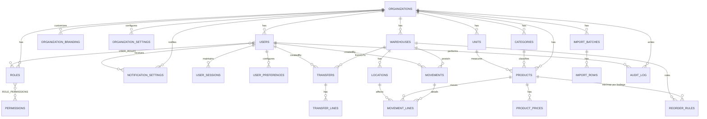
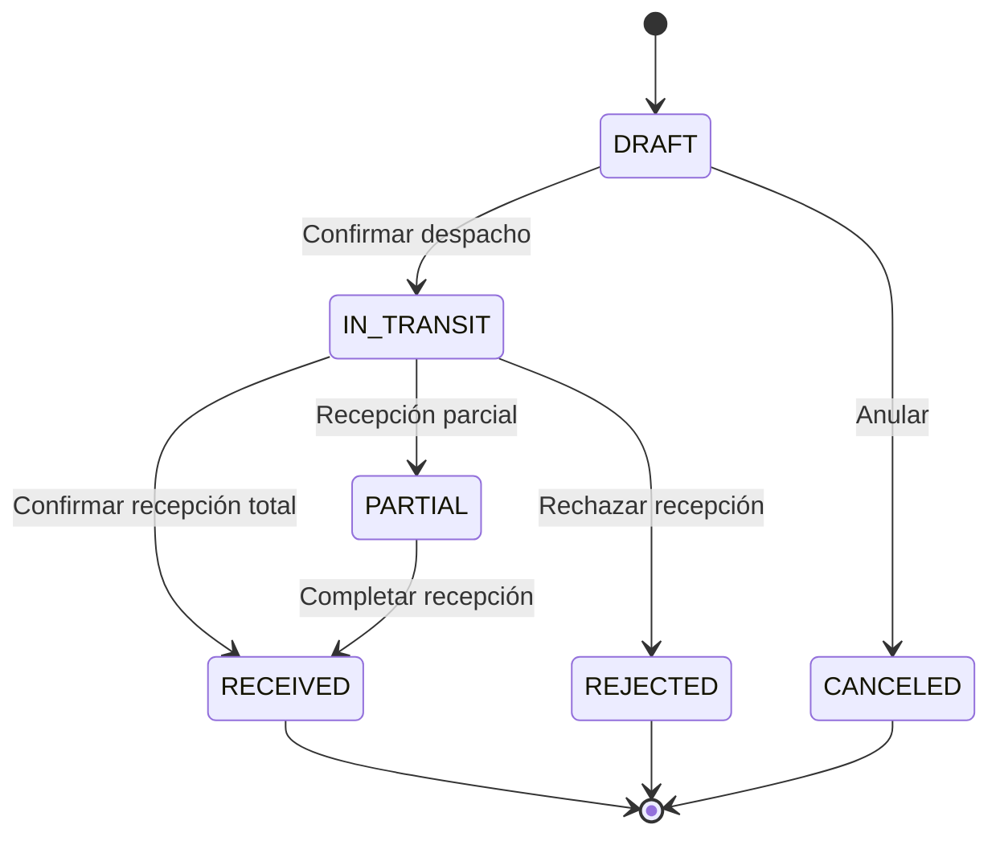
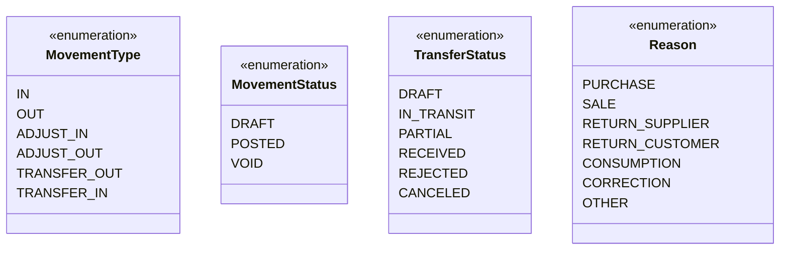

# Modelo de Datos (MVP)

## 0) Principios de diseño

- **Multi-tenant:** todo pertenece a una `organización` (org_id).
- **Trazabilidad total:** todo movimiento genera rastro (usuario, fecha, origen, destino, motivo).
- **Normalización pragmática:** catálogo único de `productos`, `unidades`, `categorías` y `bodegas`.
- **Valorización:** costo por **Promedio Ponderado Móvil** (PPM) por producto y bodega (defecto).
- **Integridad:** claves foráneas, restricciones de stock ≥ 0, SKU único.
- **Auditoría:** tabla de auditoría con _before/after_ en JSON.
  ***

## 1) Entidades (diccionario de datos)

> Claves: id = UUID v4.
>
> Timestamps: `created_at`, `updated_at` (UTC).
>
> `org_id` presente en todas las tablas “de negocio”.

### 1.1 Organización & Seguridad

- **organizations**: `id`, `name`, `tax_id`, `settings(jsonb)`, `timezone`, `currency`, `date_format`
- **organization_branding**: `id`, `org_id`, `logo_url`, `logo_alt_text`, `primary_color`, `secondary_color`, `accent_color`, `font_family`, `custom_css`
- **users**: `id`, `org_id`, `email(único por org)`, `username(único por org)`, `password_hash`, `name`, `status` (`ACTIVE`,`INACTIVE`,`LOCKED`), `last_login_at`, `failed_login_attempts`, `locked_until`
- **user_sessions**: `id`, `user_id`, `token_hash`, `refresh_token_hash`, `ip_address`, `user_agent`, `expires_at`, `created_at`
- **roles**: `id`, `org_id`, `name`, `description`, `is_system_role` (para roles predefinidos)
- **permissions**: `id`, `org_id`, `module` (`USERS`,`PRODUCTS`,`WAREHOUSES`,`MOVEMENTS`,`REPORTS`,`IMPORTS`,`SETTINGS`), `action` (`CREATE`,`READ`,`UPDATE`,`DELETE`,`POST`,`VOID`,`IMPORT`), `description`
- **user_roles**: `user_id`, `role_id` (PK compuesta)
- **role_permissions**: `role_id`, `permission_id` (PK compuesta)

### 1.2 Maestros

- **units**: `id`, `org_id`, `code` (ej. `UND`, `KG`), `name`, `precision` (decimales)
- **categories**: `id`, `org_id`, `name`, `parent_id(NULL)`
- **warehouses**: `id`, `org_id`, `code`, `name`, `address`
- **locations**: `id`, `org_id`, `warehouse_id`, `code`, `name`, `is_default`
- **products**: `id`, `org_id`, `sku(único por org)`, `name`, `description`, `unit_id`,
  `barcode(NULL)`, `brand(NULL)`, `model(NULL)`, `status`
  `cost_method` ENUM(`AVG`=promedio, `FIFO`) — _default `AVG`_
- **product_prices** _(opcional)_: `id`, `org_id`, `product_id`, `currency`, `price_type` (ej. `LIST`, `WHOLESALE`), `amount`
- **reorder_rules**: `id`, `org_id`, `product_id`, `warehouse_id`, `min_qty`, `max_qty`, `safety_qty`

### 1.3 Movimientos (Kárdex)

- **movements** (encabezado): `id`, `org_id`, `type` ENUM(`IN`,`OUT`,`ADJUST_IN`,`ADJUST_OUT`,`TRANSFER_OUT`,`TRANSFER_IN`),
  `status` ENUM(`DRAFT`,`POSTED`,`VOID`), `warehouse_id`, `reference` (doc externo),
  `reason` ENUM(`PURCHASE`,`SALE`,`RETURN_SUPPLIER`,`RETURN_CUSTOMER`,`CONSUMPTION`,`CORRECTION`,`OTHER`),
  `note`, `posted_at`, `created_by`
- **movement_lines** (detalle): `id`, `org_id`, `movement_id`, `product_id`, `location_id`,
  `qty` (signo positivo SIEMPRE; el signo real lo determina `type`),
  `unit_cost` (afecta PPM solo en entradas), `currency`, `extra(jsonb)`
- **transfers** (flujo de bodega a bodega): `id`, `org_id`, `from_warehouse_id`, `to_warehouse_id`,
  `status` ENUM(`DRAFT`,`IN_TRANSIT`,`PARTIAL`,`RECEIVED`,`REJECTED`,`CANCELED`), `created_by`
- **transfer_lines**: `id`, `org_id`, `transfer_id`, `product_id`, `qty`, `from_location_id(NULL)`, `to_location_id(NULL)`
  - Al _postear_ la transferencia se generan dos movimientos enlazados: `TRANSFER_OUT` y `TRANSFER_IN` (cuando recibe).

### 1.4 Inventario calculado & auditoría

- **inventory_snapshots** _(opcional)_: `id`, `org_id`, `as_of_date`, `warehouse_id(NULL)`, `payload(jsonb)`
- **audit_log**: `id`, `org_id`, `entity`, `entity_id`, `action` (`CREATE|UPDATE|DELETE|POST|VOID|IMPORT`),
  `user_id`, `at`, `before(jsonb)`, `after(jsonb)`, `ip(NULL)`

### 1.5 Importaciones (Excel/CSV)

- **import_batches**: `id`, `org_id`, `type` (`PRODUCTS`,`STOCK_ADJUSTMENT`,`PRICES`), `status` (`RECEIVED`,`VALIDATED`,`APPLIED`,`FAILED`), `created_by`
- **import_rows**: `id`, `batch_id`, `row_number`, `raw(jsonb)`, `is_valid`, `errors(text[])`, `applied_at(NULL)`

### 1.6 Personalización y Configuración

- **organization_settings**: `id`, `org_id`, `key`, `value`, `type` (`STRING`,`NUMBER`,`BOOLEAN`,`JSON`), `description`
- **user_preferences**: `id`, `user_id`, `key`, `value`, `type` (`STRING`,`NUMBER`,`BOOLEAN`,`JSON`)
- **notification_settings**: `id`, `org_id`, `user_id(NULL)`, `type` (`EMAIL`,`SMS`,`PUSH`,`IN_APP`), `events` (array de eventos), `enabled`, `config(jsonb)`

---

## 2) Relaciones (ERD Mermaid)



---

## 3) Estados de Transferencia



---

## 4) Reglas & validaciones clave

- **SKU único** por organización.
- **Stock nunca negativo** al postear `OUT`/`TRANSFER_OUT`/`ADJUST_OUT`.
- **PPM**: `nuevo_cost = (existencias*ppm + entrada*unit_cost) / (existencias + entrada)` (por producto+bodega).
- **Transferencias**: sólo se completan al pasar a `RECEIVED`.
- **Permisos**: operadores restringidos a su(s) bodega(s).
- **Autenticación**: contraseñas con bcrypt (salt rounds: 12), JWT con expiración configurable.
- **Sesiones**: blacklisting de tokens en logout, rate limiting por IP/usuario.

## 4.1) Roles Predefinidos del Sistema

### **Administrador (ADMIN)**

- Acceso total a todos los módulos
- Gestión de usuarios, roles y permisos
- Configuración de organización y personalización
- Importaciones masivas y auditoría completa

### **Operador de Bodega (WAREHOUSE_OPERATOR)**

- Gestión de productos en bodegas asignadas
- Registro de entradas, salidas y transferencias
- Consulta de reportes básicos
- Importaciones si está habilitado

### **Consultor/Auditor (CONSULTANT)**

- Solo lectura en todos los módulos
- Acceso a reportes y auditoría
- Sin capacidad de modificación

### **Supervisor (SUPERVISOR)**

- Gestión de movimientos y transferencias
- Aprobación de ajustes de inventario
- Reportes avanzados
- Sin gestión de usuarios

## 4.2) Módulos y Permisos

| Módulo     | CREATE               | READ  | UPDATE            | DELETE     | POST       | VOID       | IMPORT              |
| ---------- | -------------------- | ----- | ----------------- | ---------- | ---------- | ---------- | ------------------- |
| USERS      | ADMIN                | ALL   | ADMIN             | ADMIN      | -          | -          | -                   |
| PRODUCTS   | ADMIN, SUPERVISOR    | ALL   | ADMIN, SUPERVISOR | ADMIN      | -          | ADMIN      | ADMIN, SUPERVISOR\* |
| WAREHOUSES | ADMIN                | ALL   | ADMIN             | ADMIN      | -          | -          | -                   |
| MOVEMENTS  | OPERATOR, SUPERVISOR | ALL   | DRAFT only        | DRAFT only | SUPERVISOR | SUPERVISOR | -                   |
| REPORTS    | -                    | ALL   | -                 | -          | -          | -          | -                   |
| SETTINGS   | ADMIN                | ADMIN | ADMIN             | ADMIN      | -          | -          | -                   |

\*Solo si está habilitado por administrador

---

## 5) Vistas y consultas recomendadas

- **v_inventory_balance**: saldo por `product_id`, `warehouse_id`, `location_id`

  ```sql
  CREATE VIEW v_inventory_balance AS
  SELECT
    ml.org_id,
    ml.product_id,
    m.warehouse_id,
    ml.location_id,
    SUM(
      CASE m.type
        WHEN 'IN' THEN ml.qty
        WHEN 'ADJUST_IN' THEN ml.qty
        WHEN 'TRANSFER_IN' THEN ml.qty
        ELSE -ml.qty
      END
    ) AS qty
  FROM movement_lines ml
  JOIN movements m ON m.id = ml.movement_id
  WHERE m.status = 'POSTED'
  GROUP BY ml.org_id, ml.product_id, m.warehouse_id, ml.location_id;

  ```

- **v_low_stock**: productos bajo mínimo

  ```sql
  CREATE VIEW v_low_stock AS
  SELECT
    r.org_id, r.product_id, r.warehouse_id, r.min_qty, b.qty AS on_hand
  FROM reorder_rules r
  LEFT JOIN (
    SELECT org_id, product_id, warehouse_id, SUM(qty) qty
    FROM v_inventory_balance
    GROUP BY org_id, product_id, warehouse_id
  ) b ON b.org_id=r.org_id AND b.product_id=r.product_id AND b.warehouse_id=r.warehouse_id
  WHERE COALESCE(b.qty,0) < r.min_qty;

  ```

- **v_inventory_valuation** (PPM): costo total por producto+bodega (`qty * ppm_actual`).

---

## 6) Índices sugeridos

- `products(org_id, sku)` **UNIQUE**
- `movement_lines(movement_id)`
- `movements(org_id, status, posted_at)`
- `v_inventory_balance(product_id, warehouse_id)` _(índice en materialized view si se usa)_
- `reorder_rules(org_id, product_id, warehouse_id)` **UNIQUE**

---

## 6.1) Personalización de Marca

### **Configuración de Colores**

- **Primary Color**: Color principal de la marca (hex)
- **Secondary Color**: Color secundario (hex)
- **Accent Color**: Color de acento para botones y enlaces (hex)
- **Font Family**: Familia de fuente principal (ej: 'Inter', 'Roboto')

### **Logo y Branding**

- **Logo URL**: URL del logo de la organización
- **Logo Alt Text**: Texto alternativo para accesibilidad
- **Custom CSS**: CSS personalizado adicional (opcional)

### **Configuraciones de Organización**

- **Timezone**: Zona horaria por defecto (ej: 'America/Bogota')
- **Currency**: Moneda por defecto (ej: 'COP', 'USD')
- **Date Format**: Formato de fecha (ej: 'DD/MM/YYYY', 'MM/DD/YYYY')

## 7) Plantillas de Importación (Excel/CSV)

### 7.1 Ajuste/Inicialización de stock

Campos soportados (cabecera exacta):

- `Ubicación`, `Código` (SKU), `Nombre` (opcional), `Unidad de medida`, `Cantidad`,
  `Costo Unitario`, `Costo Total` _(opcional; si viene, valida ≈ Cantidad×Costo Unitario)_,
  `Precio Venta Unitario` _(opcional)_, `Precio Venta Total` _(opcional)_

Ejemplo (CSV):

```
Ubicación,Código,Nombre,Unidad de medida,Cantidad,Costo Unitario,Costo Total,Precio Venta Unitario,Precio Venta Total
BOD-CENTRO:A1,SKU-001,Tornillo 1",UND,100,120,12000,200,20000
BOD-CENTRO:B2,SKU-002,Arandela 10mm,UND,50,80,4000,150,7500

```

**Mapeo**:

- `Ubicación` → `locations.code`
- `Código` → `products.sku` _(si no existe y se permite, se crea con `Nombre` y `Unidad de medida`)_
- `Cantidad` → `movement_lines.qty` (tipo `ADJUST_IN` si es inicialización positiva)
- `Costo Unitario` → `movement_lines.unit_cost` (afecta PPM)
- `Precio Venta Unitario` → `product_prices.amount` (`price_type='LIST'`)

### 7.2 Catálogo de productos

```
SKU,Nombre,Unidad,Categoría,Barcode,Marca,Modelo,Estado
SKU-001,Tornillo 1",UND,FERRETERIA,7701234567890,ACME,TX-1,ACTIVE

```

Validaciones de carga:

- SKU no duplicado; unidad existente; cantidades ≥ 0; costos ≥ 0.
- Reporte de errores por fila en `import_rows.errors`.

---

## 8) DDL base (PostgreSQL, extracto)

> Nota: Ejemplo abreviado para tablas críticas.

```sql
-- PRODUCTS
CREATE TABLE products (
  id uuid PRIMARY KEY,
  org_id uuid NOT NULL,
  sku text NOT NULL,
  name text NOT NULL,
  description text,
  unit_id uuid NOT NULL,
  barcode text,
  brand text,
  model text,
  status text NOT NULL DEFAULT 'ACTIVE',
  cost_method text NOT NULL DEFAULT 'AVG',
  created_at timestamptz NOT NULL DEFAULT now(),
  updated_at timestamptz NOT NULL DEFAULT now(),
  UNIQUE(org_id, sku),
  FOREIGN KEY (unit_id) REFERENCES units(id),
  FOREIGN KEY (org_id) REFERENCES organizations(id)
);

-- MOVEMENTS
CREATE TABLE movements (
  id uuid PRIMARY KEY,
  org_id uuid NOT NULL,
  type text NOT NULL,
  status text NOT NULL DEFAULT 'DRAFT',
  warehouse_id uuid NOT NULL,
  reason text,
  reference text,
  note text,
  posted_at timestamptz,
  created_by uuid NOT NULL,
  created_at timestamptz NOT NULL DEFAULT now(),
  updated_at timestamptz NOT NULL DEFAULT now(),
  FOREIGN KEY (warehouse_id) REFERENCES warehouses(id),
  FOREIGN KEY (created_by) REFERENCES users(id),
  FOREIGN KEY (org_id) REFERENCES organizations(id)
);

-- MOVEMENT_LINES
CREATE TABLE movement_lines (
  id uuid PRIMARY KEY,
  org_id uuid NOT NULL,
  movement_id uuid NOT NULL,
  product_id uuid NOT NULL,
  location_id uuid NOT NULL,
  qty numeric(18,6) NOT NULL CHECK (qty > 0),
  unit_cost numeric(18,6),
  currency text DEFAULT 'COP',
  extra jsonb,
  FOREIGN KEY (movement_id) REFERENCES movements(id),
  FOREIGN KEY (product_id) REFERENCES products(id),
  FOREIGN KEY (location_id) REFERENCES locations(id),
  FOREIGN KEY (org_id) REFERENCES organizations(id)
);

```

---

## 9) Diagramas de tipos (Mermaid)



---

## 10) Notas de implementación

- **API**: expose _endpoints_ for catalog, movements (posting and reversal), transfers and reports.
- **Concurrencia**: aplicar _row-level locking_ al postear movimientos por `(org_id, product_id, warehouse_id)` para integridad de PPM y stock.
- **Materialización**: si el volumen crece, materializar `v_inventory_balance` y refrescar por lotes.

## 10.1) Implementación de JWT y Seguridad

### **Estructura del Token JWT**

```json
{
  "header": {
    "alg": "HS256",
    "typ": "JWT"
  },
  "payload": {
    "sub": "user_id",
    "org_id": "organization_id",
    "roles": ["ADMIN", "SUPERVISOR"],
    "permissions": ["PRODUCTS:CREATE", "MOVEMENTS:POST"],
    "iat": 1516239022,
    "exp": 1516242622,
    "jti": "unique_token_id"
  }
}
```

### **Refresh Token Strategy**

- **Access Token**: 15 minutos de duración
- **Refresh Token**: 7 días de duración
- **Rotación**: Nuevo refresh token en cada renovación
- **Blacklisting**: Tokens invalidados en logout

### **Rate Limiting**

- **Por IP**: 100 requests/minuto
- **Por Usuario**: 1000 requests/hora
- **Por Endpoint**: Configurable por tipo de operación

### **Validación de Permisos**

- Middleware de autorización en cada endpoint
- Validación de `org_id` en todas las operaciones
- Cache de permisos del usuario (5 minutos)
- Auditoría de accesos denegados
